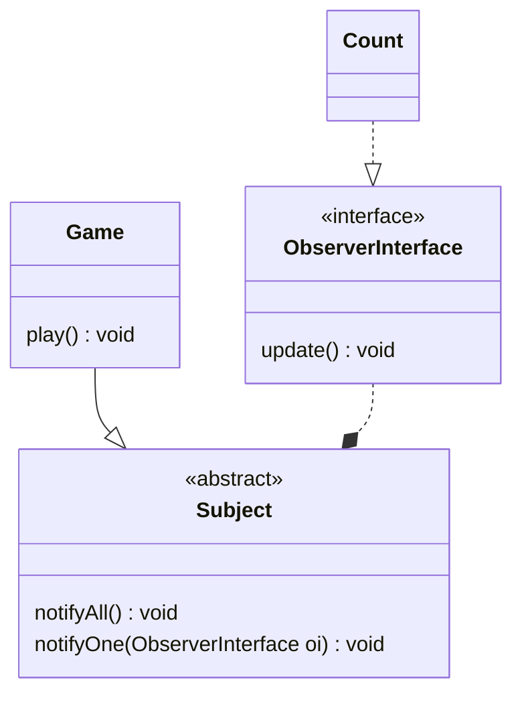

# Sum Product Tax Problem

Quando Iniciado o jogo deve ser contado a quantidade de vezes no qual uma peça foi jogada, mas deve respeitar o SOLID

### Diagrama

## Run

### Rode o código

` python3.10 index.py`
