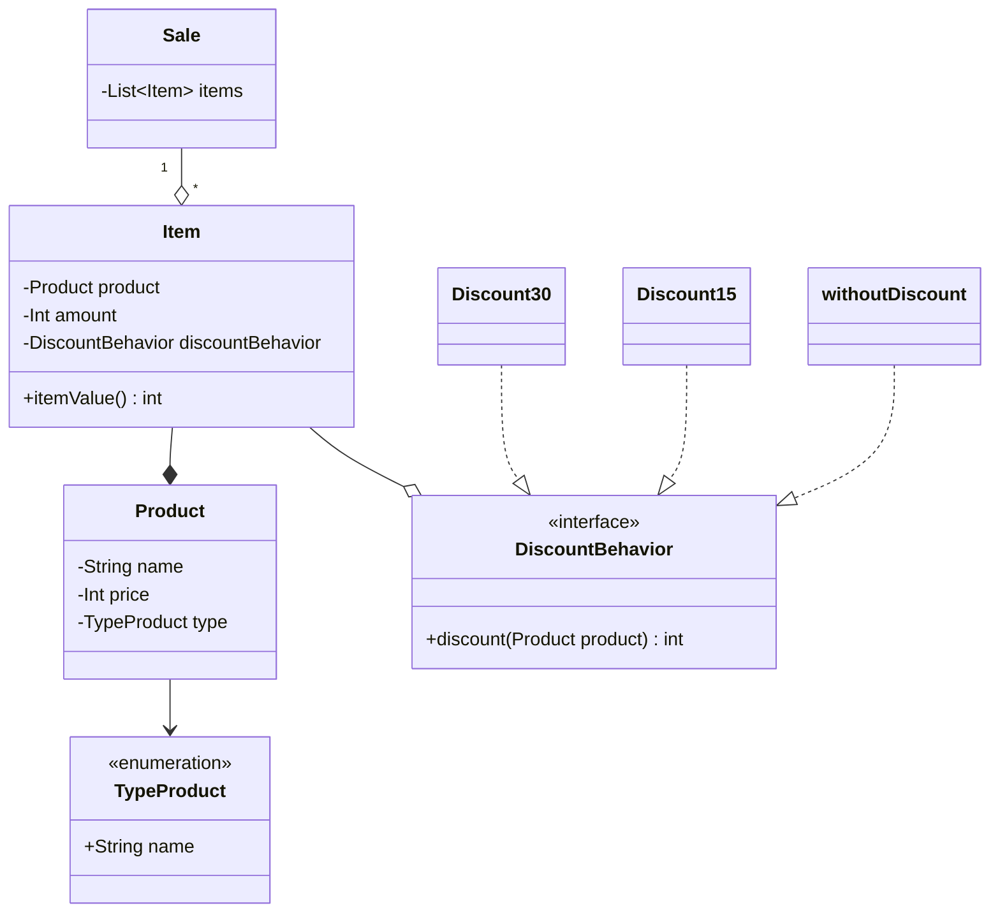

# BookStore Problem

Livraria Yoda vende diversos artigos consistindo de Livros, Revistas e Jogos. Há livros e revistas impressos e digitais. A livraria possui Jogos de Tabuleiro e Jogos de Vídeo Game, sendo o último o jogo físico ou
digital. No pagamento a vista, temos a seguinte política de descontos:

- Livros, Revistas Físicos e Jogos de Tabuleiro: 30% de desconto.
- Livros e Revistas Digitais: 15% de desconto.
- Não há desconto para Jogos de Vídeo Game.

Porém, a livraria pode ter promoções especiais durante o ano, de modo que os descontos dos
produtos podem mudar.
### Diagrama

## Run

### Instale as dependências

`npm install `

### Rode o código

` npm run dev`
