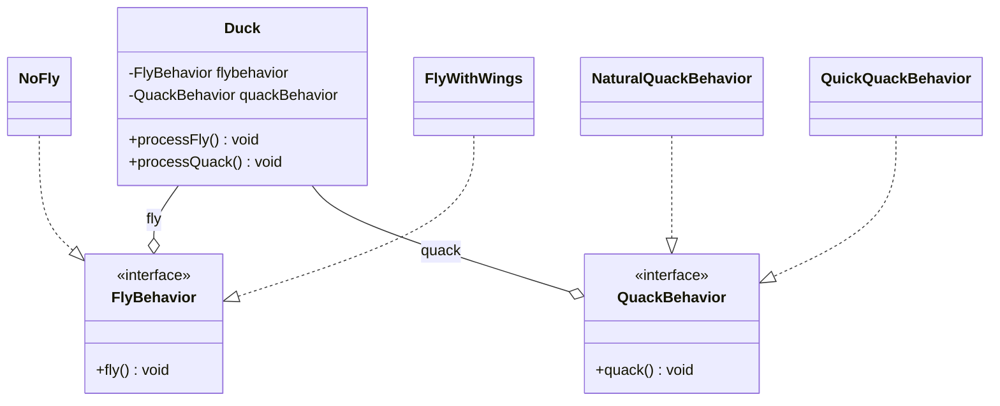

# Duck Problem

Uma empresa de jogos de texto tem um jogo chamado duck survival, neste jogo tem vários tipos de patos, pato normal, pato de plástico e etc. O problema é que um comportamento de voar e falar está sendo repetido por todos os tipos de patos, porém um pato normal não faz o mesmo quack que um pato de borracha.

### Diagrama

## Run

### Rode o código

` python3.10 index.py`
