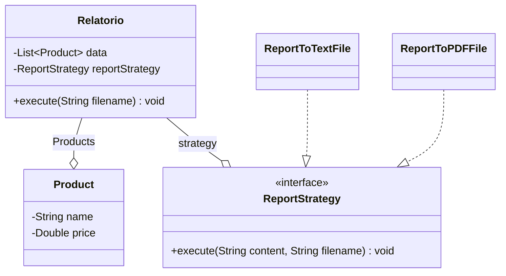

# Show Report Problem

Uma Loja do ramo do varejo necessita que seja feito um relatório dos produtos vendidos por mês. Este relatório deve,por enquanto, ser mostrado em um arquivo Texto, pois a diretoria está vendo se será necessário mostrar o relatório em arquivo PDF.

### Diagrama

## Run

### Instale as dependências

`bundle install `

### Rode o código

` ruby index.rb`
