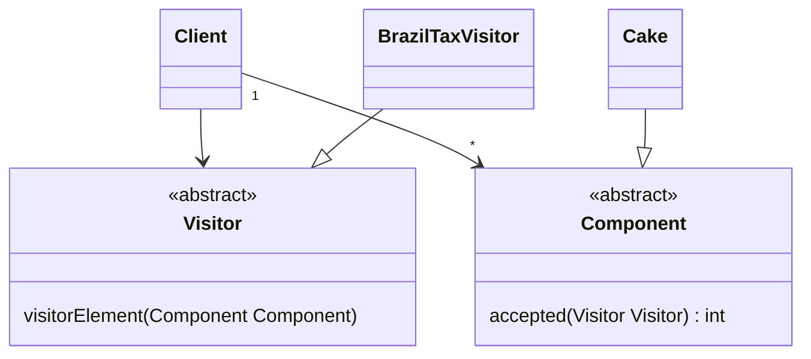

# Sum Product Tax Problem

Uma empresa internacional necessita que o seu programa calcule as somas dos produtos exportados, mas com determinadas taxas que variam de pais para pais, porém quando você fizer de um único não poderá mudar o código dos componentes vendidos

### Diagrama

## Run

### Rode o código

` python3.10 index.py`
