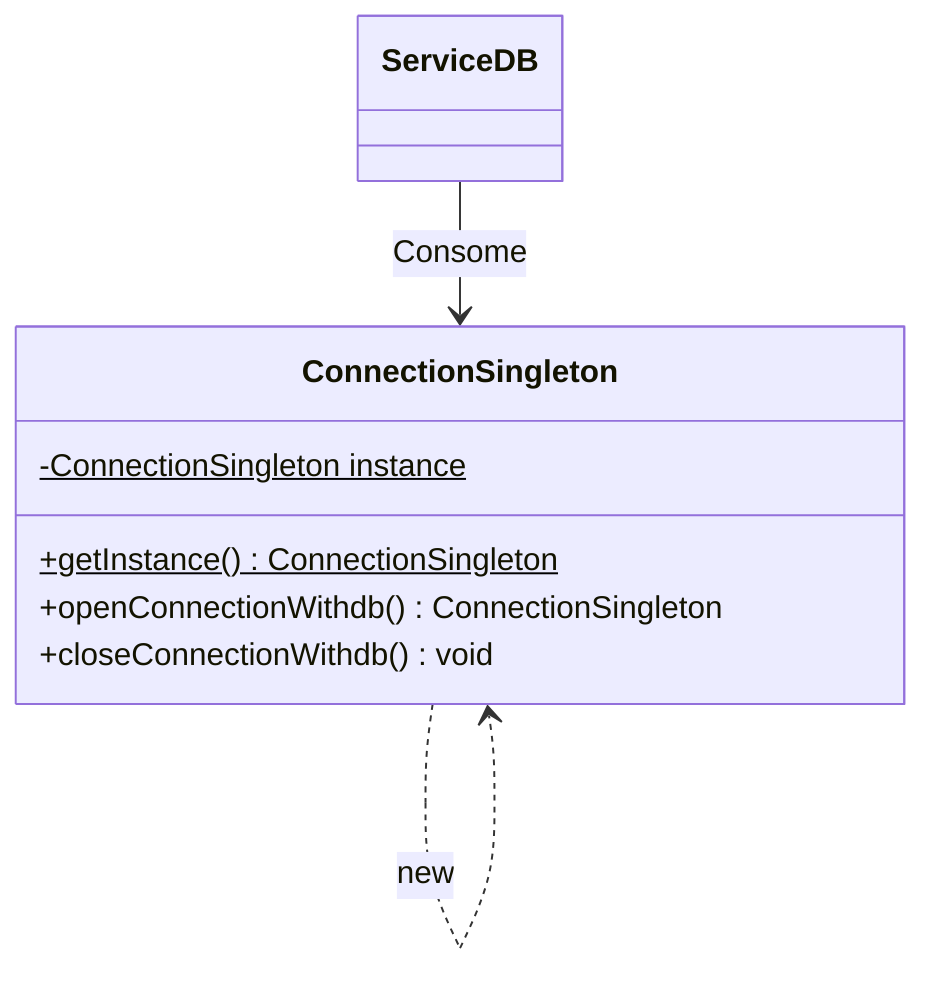

# Very Connection to database problem

Alguns desenvolvedores querem que seja feita uma conexão com o banco de dados, pois com o atual algoritmo tudo vez que está fazendo uma query está criando uma conexão e assim consumindo memória. É necessário que você implemente uma solução para ter apenas uma conexão ao banco.

### Diagrama

## Run

### Instale as dependências

`npm install `

### Crie um arquivo tmp.db e coloque o banco sql lá dentro

### Pesquise por dbBrowser for SQLite

### Rode o código

` npm run dev`
