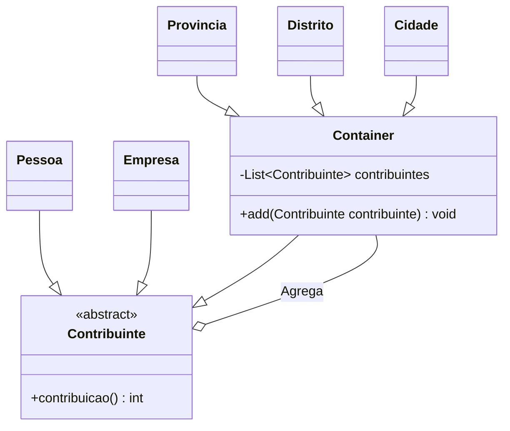

# Bank Stock Info Problem

# Bank Stock Info Problem

Um cobrador de impostos entrevista pessoas, perguntando-lhes qual é o seu rendimento, para poder calcular o montante a cobrar. O cobrador é muito competente e, além de pessoas individuais, pode também abordar empresas e realizar a mesma operação. Tanto as empresas, como as pessoas, são vistas como contribuintes singulares. Para melhorar a agilidade das finanças públicas, os cobradores de impostos foram treinados para cobrarem impostos em regiões geográficas (províncias, distritos, cidades). As províncias contêm vários distritos. Os distritos contêm várias cidades, assim como pessoas e empresas (situadas em regiões rurais). As cidades contêm pessoas e empresas.

Implemente o cobrador de impostos por forma a não ser sensível às várias distribuições de contribuintes. Assuma que o cobrador de impostos invoca sempre o método contribuição sobre o contribuinte (retorna um valor inteiro). As entidades não atómicas permitem a adição de outras entidades, de acordo com as suas restrições específicas.

# Diagrama

## Run

### Instale as dependências

`npm install `

### Rode o código

` npm run dev`

## Run

### Instale as dependências

`npm install `

### Crie um arquivo .env e adicione a sua key pega pelo site

[Alpha Vantage](https://www.alphavantage.co/support/#api-key)

### Rode o código

` npm run dev`
