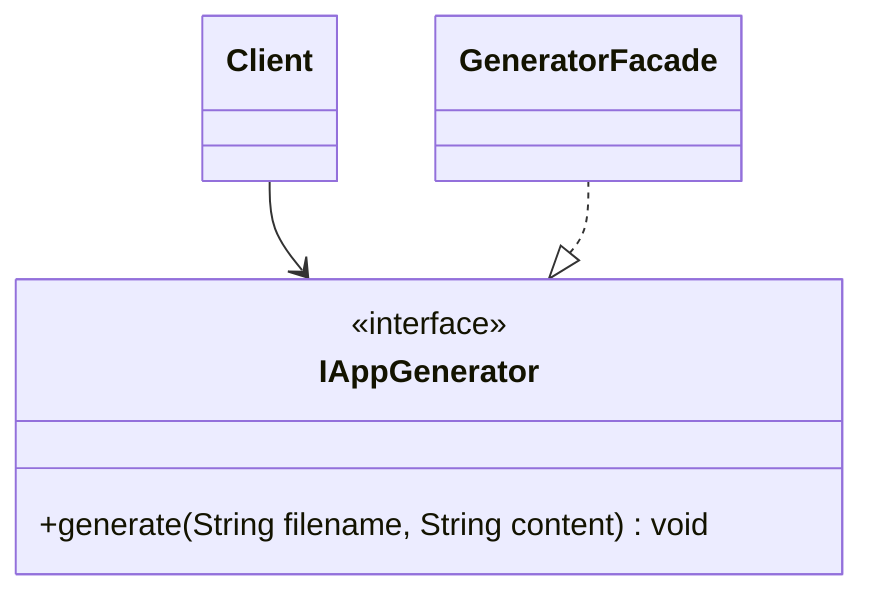

# Bank Stock Info Problem

Uma desenvolvedor quer fazer com que a sua aplicação gere pdfs, então ele optou por usar a biblioteca open-sorce jsPDF, porém este estava chamando os métodos dessa biblioteca dentro da classe cliente que necessita do pdf. Desta forma, a classe cliente não respeitou os princípios SOLID e ficou bastante acoplada. É sua função fazer uma refatoração nesse código e deixar mais manutenível.

## Diagrama

## Run

### Instale as dependências

`npm install `

### Rode o código

` npm run dev`
